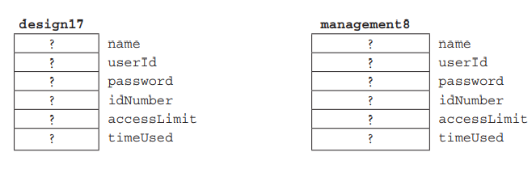

## Sobre class
Hasta el momento hemos utilizado variables y constantes denominados tipos fundamentales en C++ - `int, double, bool, char ` y sus variantes. Estos son adecuados para programar tareas en el cual los elementos y operaciones que se modelan son lo suficientemente simples.

El problema es que los objetos en la realidad no son tan simples. Ejemplo un administrador de redes debe crear una cuenta de usuario para los empleados de una empresa. Cada cuenta puede contener información del empleado tales como:

    1. Nombre
    2. ID de usuario
    3. Contraseña
    4. Número de identificación del empleado
    5. Límite de minutos de acceso
    6. Minutos utilizados
    .
    .
    .


Por simplicidad, utilizando solo estos 6 elementos, una forma de proceder sería declarar las siguientes variables 

````cpp
string name;
string userID;
string password;
int idNumber;
int acccessLimit;
double timeUsed;
````

Si necesitamos una función para mostrar información sobre un empleado ?

````cpp
void printUserInfo(string name, string userId, string password,
int idNumber, int accessLimit, double timeUsed)
 {
cout << name << endl
<< "User Id: " << userId << endl
<< "Password: " << password<< endl
<< "Id Number: " << idNumber<< endl
<< "Access Limit: " << accessLimit<< endl
<< "Time Used: " << timeUsed<< endl
 }
````
El cual puede ser llamado asi

```cpp
printUserInfo(userName, userId, userPassword,
empNumber, resourceLimit, resourcesUsed);
```

De forma similar una función para ingresar información sobre el uso de la computadora por parte de un empleado, lo llamariamos así

```cpp
readUserInfo(userName, userId, userPassword,
 empNumber, resourceLimit, resourcesUsed);
```

- El principal problema de este enfoque es que cada función que definamos para procesar
información sobre los usuarios de la computadora necesitará un parámetro independiente para cada elemento de información y las llamadas a estas funciones deben pasar cada argumento al parámetro correcto.

- Con solo seis parámetros, como en nuestro ejemplo, esto puede no parecer problemático, pero para objetos más
complejos, se debe pasar más información y este enfoque se vuelve más engorroso y propenso a errores. ¡Imagínese tener que ingresar el código fuente de un programa
que tenía 50 llamadas de función, cada una con 100 o más argumentos!

- La dificultad básica de este enfoque es que hay un tipo de objeto (un usuario de computadora) que queremos modelar, y sin embargo debemos pasar más de una pieza de información a
las operaciones. Para aliviar este problema, C++ proporciona la construcción struct (de C) y
su extensión a una clase. Cuando los programadores crean una estructura o clase, crean un nuevo tipo,
con espacio para las características de los objetos de ese tipo. Por ejemplo, el tipo string
utilizado en el Ejemplo 7.1 es en realidad una clase creada por algún programador.

- En la discusión que sigue, solo describiremos las características principales de las estructuras y
las clases, dejando la mayoría de los detalles para un capítulo posterior. Sin embargo, al final de esta sección,
debería saber qué son y cómo usarlas.

- Las estructuras y clases proporcionan una forma de encapsular las características de un objeto (tanto atributos como comportamiento) dentro de un único "envoltorio". Por ejemplo, para crear un nuevo tipo llamado
ComputerUser para modelar los usuarios de computadoras descritos anteriormente, podríamos usar cualquiera de los siguientes:



- Esta encapsulación es importante, porque un único objeto como design17 ahora almacena todos sus
propios datos y resuelve nuestro problema anterior, porque nos permite pasar un objeto complicado
a una función usando solo un argumento (y declarando solo un parámetro); por ejemplo,

```cpp
struct ComputerUser{
    string name,
           user, 
           password;
    int idNumber,
        access;
    double timeUsed;
}
```

Los identificadores name, userId, password, idNumber, accessLimit y timeUsed
se denominan miembros de datos (o variables de instancia o variables de atributo) de la estructura
y la clase.
C++ trata el nombre ComputerUser como el nombre de un nuevo tipo y, por lo tanto, se puede utilizar para declarar objetos:


- Cuando la clase se ha creado, normalmente se almacena en una biblioteca, con su declaración almacenada en el archivo de encabezado de la biblioteca y las definiciones de sus funciones miembro no triviales en un archivo de implementación.

- Para utilizar la clase, un programa debe incluir el archivo de encabezado de la biblioteca.

Esta breve introducción a las clases debería indicar su importancia en C++. Las clases son la mayor diferencia entre C++ y su lenguaje padre, C. De hecho, antes de 1983, el lenguaje C++ se llamaba "C con clases". Una parte importante de aprender a programar en C++ es aprender a utilizar las clases estándar que forman parte del lenguaje, para evitar reinventar la rueda. En las secciones que siguen, examinaremos cuatro de estas clases:
istream, ostream, string y complex.
En resumen, C++ proporciona el mecanismo de clases para crear tipos que representen objetos complicados. Este mecanismo nos permite crear una única estructura que encapsula (i) miembros de datos que definen las características del objeto y (ii) funciones miembro que definen las operaciones sobre el objeto. Se puede acceder a los miembros de clase que se designan como públicos dentro de la clase mediante la notación de puntos.